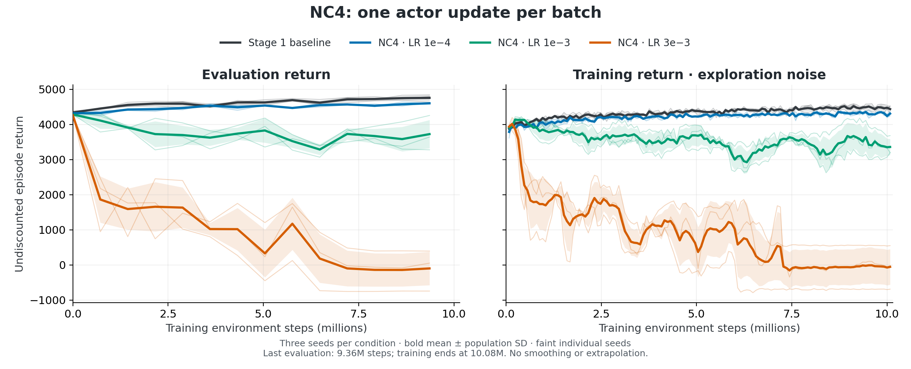

# Stage 2: DPPO clipping ablations

Which clipping mechanisms support stable HalfCheetah-v2 fine-tuning, and does their effect depend on reusing a batch for multiple actor updates?

**NC4 learns stably at LR 1e-4, degrades at 1e-3, and collapses in all three seeds at 3e-3.** Avoiding repeated actor updates does not by itself prevent collapse at the largest tested learning rate. The nine-run NC4 subset is complete; the full comparison still awaits the R0 and NC1 seed-1 replacements.

## Analysis: NC4 learning rates

| Condition | Last eval, mean ± SD | Collapsed seeds |
|---|---:|---:|
| Stage 1 baseline | 4,758 ± 88 | 0/3 |
| NC4, LR 1e-4 | 4,604 ± 16 | 0/3 |
| NC4, LR 1e-3 | 3,726 ± 404 | 0/3 |
| NC4, LR 3e-3 | −98 ± 477 | 3/3 |

The last scheduled evaluation is at 9.36 million training steps; all runs finish training at 10.08 million. SD is population standard deviation across three independent seeds, not a confidence interval. Collapse means any evaluation below half that seed's initial return or any scientific NaN/inf; every NC4 run remained finite.

Evaluation and exploratory training returns compare three fixed NC4 actor learning rates with the unchanged baseline. Faint lines show seeds; bold lines and bands show mean ± population SD, without smoothing or extrapolation. LR 1e-4 improves from 4,320 to 4,604, ending 3.3% below the baseline mean; three seeds do not establish equivalence.

The [diagnostic figure](curated/halfcheetah-nc4-diagnostics.png) shows increasing post-update changes with learning rate, despite every one of 1,134 actor updates having pre-step ratio exactly 1 and clip fraction 0. Per-seed median diagnostic KL ranges from 0.00053–0.00063 at 1e-4 to 4.57–4.79 at 3e-3. This sampled denoising-transition statistic is not exact final-action KL; four exact zeros are omitted only from logarithmic rendering and retained in numerical summaries.

Compared with NC2, NC4 changes sample reuse, actor-update count and gradient aggregation together. The findings cannot identify reuse as the sole cause. Coordinate-mean ratio tempering, denoised-action clipping, noise floors and the critic remain unchanged. NC2 and NC3 also crossed the collapse threshold in all three seeds; [saved evidence](runs/monitor_checks/20261010T041346_status.json) retains those comparisons.

All twelve baseline/NC4 inputs, their endpoint statistics and all NC4 step invariants passed [independent verification](runs/nc4_analysis/verification.json). [Per-seed table](curated/halfcheetah-nc4-seed-results.csv), [captions](curated/halfcheetah-nc4-captions.md), [source paths and command](runs/nc4_analysis/analysis_record.json), and [methods](methods.md#nc4-subset-analysis-requested-before-campaign-completion) make the subset reproducible. The approved PNG/PDF figures and CSV are [curated](curated/INDEX.md); source candidates remain preserved.

## Execution and remaining work

My earlier scheduler handoff interrupted R0 and NC1 seed 1 after 138/140 iterations. [Failure evidence](provenance/parallel_handoff_failure.json) and [checkpoint audit](provenance/interrupted_resume_audit.json) explain why faithful continuation was impossible. Their raw outputs survive; completed seeds were not repeated. Two [authorized fresh replacements](provenance/interrupted_recovery_authorization.json) started October 9 at 10:15 p.m. PDT, with 2h15m caps; estimated completion remains October 10 around 12:20–12:30 a.m.

Scientific source remains clean at `ab46b150fa34b5a5b457cd4062cd4c5ad830d964`. The [fixed-batch gate](runs/verification_full_update/verification.json) passed with zero CPU/A6000 differences and isolated diagnostic RNG; trajectories do not gate equivalence. NC4 used A6000 throughout; only NC1 seed 2 used the verified H200 exception. The [58.5 GPU-hour budget](provenance/interrupted_recovery_budget.json), original deadline, 40 workers and 30-minute monitors remain unchanged. Stage 1 is read-only.

<!-- campaign-status-start -->
Original campaign terminal: 17 ablations completed; two interrupted attempts remain preserved. Original allocations ended before recovery began; their monitors are paused. [Verified status](runs/monitor_checks/20261010T052335_status.json).
<!-- campaign-status-end -->

<!-- recovery-status-start -->
Recovery (2026-10-10T05:38:25+00:00): running_replacements; R0_recovery_seed0: running, NC1_recovery_seed1: running; next: check replacement outputs. [Run record](runs/recovery_campaign.json).
<!-- recovery-status-end -->
